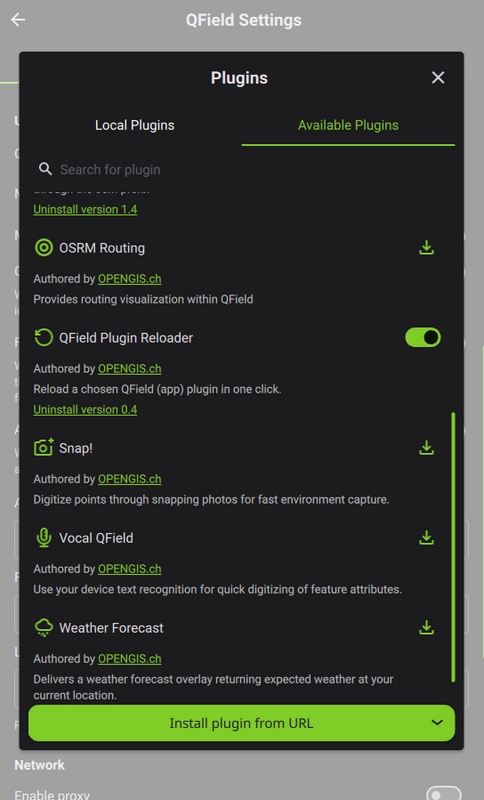

# Development workflow

Now that a QField plugin has been generated, let's dev it further !

!!! note
    The following commands are to be run in the generated plugin directory, e.g. `qfplugin-my-topologizer/` if the plugin name is `My Topologizer` (slugified to `my-topologizer`).

## Load the plugin in QField

- [x] Download a version of a QField build, pick a recent version [from the recent releases](https://github.com/opengisch/qfield/releases).

If you are on Linux, you may need to set the `+x` permission on the downloaded QField build:

```sh
chmod +x qfield-X.Y.Z-linux-x64.AppImage
```

- [x] Open this QField build, go to [the Plugins Manager](https://docs.qfield.org/how-to/advanced-how-tos/plugins/#application-plugins) and install the `QField plugin reloader`:



- [x] Create a symbolic link from the generated plugin directory into the QField plugins directory:

```sh
ln -s /path/to/the/generated/directory/qfplugin-my-topologizer/my-topologizer \
    "~/Documents/QField Documents/QField/plugins"
```

!!! note
    - The QField plugins directory is located in the `QField Documents` directory, which is created in your home when you first run QField. If you have changed the location of this directory, please adapt the command above accordingly.
    - The symbolic link must point to the plugin directory, not the parent directory. In this example, the plugin directory is `my-topologizer`, which is inside the generated directory `qfplugin-my-topologizer`.

## Test locally

!!! note
    QGIS4 must be installed on the machine for testing! See [installation instructions](https://qgis.org/resources/installation-guide/#linux).

- [x] Install `uv` locally:

```sh
python3 -m pip install uv --break-system-packages
```

- [x] Create local virtualenv with system packages and sync:

```sh
uv venv --system-site-packages
uv sync
```

- [x] Add system packages to local virtual env (hacky):

```sh
SITE_PACKAGES=$(uv run python -c "import site; print(site.getsitepackages()[0])")
echo "/usr/share/qgis/python" > "$SITE_PACKAGES/qgis.pth"
```

- [x] Test that imports are fine:

```sh
uv run python -c "import qgis; print(qgis.__file__)"
uv run python -c "import PyQt6; print(PyQt6.__file__)"
uv run python -c "from PyQt6.QtCore import QT_VERSION_STR; print(QT_VERSION_STR)"
```

- [x] Clone QField locally, e.g.:

```sh
git clone --depth 1 [--branch release-4_2] https://github.com/opengisch/QField.git
```

- [x] Run tests:

```sh
uv run pytest tests -v --qgis_disable_gui
```

## Translate the plugin

- [x] install the required tools:

```sh
sudo apt install -y qt6-base-dev qt6-tools-dev-tools
```

- [x] configure the `translations.pro` generated file with the languages you want to support, located inside the `qfplugin-my-topologizer/my-topologizer/` generated plugin directory.

For instance, to support French and German, set the `TRANSLATIONS` variable to the following:

```sh
TRANSLATIONS += \
    main_de.ts main_fr.ts
```

- [x] generate the translations strings:

```sh
lupdate my-topologizer/translations.pro
```

!!!note
    If you have both Qt5 and Qt6 tools installed, make sure you use the Qt6 ones, e.g. by using `/usr/lib/qt6/bin/lupdate` on Linux.

- [x] open the generated `.ts` files with [`Qt Linguist`](https://doc.qt.io/qt-6/qtlinguist-index.html), using the GUI or the command line:

```sh
linguist my-topologizer/main_fr.ts
```

!!!note
    If you have both Qt5 and Qt6 tools installed, make sure you use the Qt6 ones, e.g. by using `/usr/lib/qt6/bin/linguist` on Linux.

- [x] compile the translations to `.qm` files:

```sh
lrelease my-topologizer/translations.pro
```

!!!note
    If you have both Qt5 and Qt6 tools installed, make sure you use the Qt6 ones, e.g. by using `/usr/lib/qt6/bin/lrelease` on Linux.
