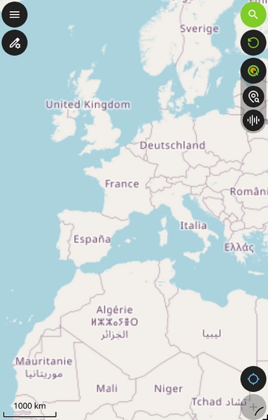
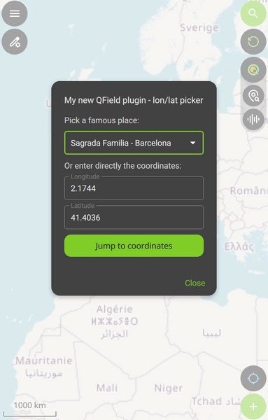
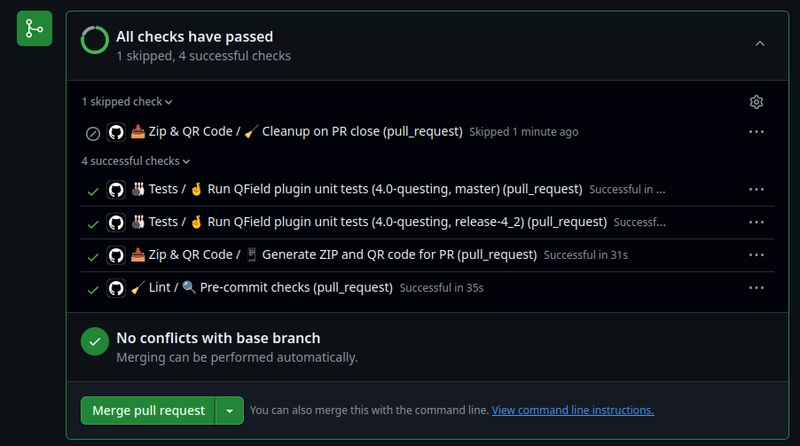
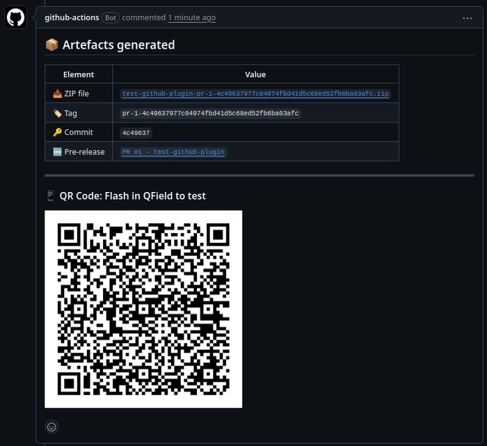

# What you get

After the plugin template is generated, here is what you get in the new directory:

- [x] a QField plugin made of QML code. It contains a bit of logic and some UI components for your plugin. See more in [the `QField plugin` section](#qfield-plugin).

- [x] a test framework setup allowing to test the plugin, using [`pytest-qfield`](https://pypi.org/project/pytest-qfield/).

- [x] CICD jobs configured to run different elements around the new plugin in a CI: linting, tests, releases, etc. [GitHub Actions](https://docs.github.com/en/actions) and [GitLab CI](https://docs.gitlab.com/ci/) are currently supported.

- [x] a translation framework allowing you to translate the plugin to several languages, using the Qt tools e.g. [`Qt Linguist`](https://doc.qt.io/qt-6/qtlinguist-index.html).

- [x] a [`pre-commit`](https://pre-commit.com/) configuration, that guarantees homogeneous formatting and linting across contributions.

## Template structure

## QField plugin

You get a generated QField plugin made of [QML code](https://doc.qt.io/qt-6/qtqml-index.html), which contains a bit of logic and some UI components for your plugin. It is located in the main generated directory.

- The `metadata.txt` file contains the plugin's metadata, and is used by QField to display the plugin in the list of the available ones. This file is mainly filled with the given template parameters.

- The `main.qml` file is the main entry point of the plugin, and contains the main logic and UI components. It basically adds buttons to the QField interface:

- The first button opens a dialog, which is a QML component defined in the `FamousPlacesDialog.qml` file. This dialog allows to make the QField map canvas jump to a place, which can be selected from a list:

- The second button opens a dialog, which is a QML component defined in the `MultimediaDialog.qml` file. This dialog allows to interact with the QField "multimedia" capabitilities, e.g. play sounds, vibrate, etc.

!!! tip
    Browse [the QField API docs](https://api.qfield.org/) to enhance it.

## Tests

You get a generated template directory contains a test framework setup allowing to test the plugin, using [`pytest-qfield`](https://pypi.org/project/pytest-qfield/). The tests are located in the `tests` directory, and are written in Python. Those tests require to clone the QField repository, and will test the plugin via Qt6.

See [the test dev workflow](dev_workflow.md#test-locally) for more information on how to run the tests.

## CICD setup

Depending on which CI platform you chose during the template generation, you get a CICD configuration for either [GitHub Actions](https://docs.github.com/en/actions) or [GitLab CI](https://docs.gitlab.com/ci/).

Here are the CICD jobs that are configured to run different elements around the new plugin in a CI:

- **linting**: this job will ensure that the code is respecting the setup `pre-commit` hooks.
- **tests**: this job will run the tests for the plugin.
- **qr codes**: this job will generate temporary QR codes for the plugin, which can be used to install a specific version of the plugin in the QField plugin manager, to test this version on a mobile device.
- **release**: this job will handle the release process for the plugin.

### GitHub Actions

The configuration is located in the `.github` directory, and is also making use of the `scripts/github` JS scripts designed to interact with GitHub APIs.

Here is an overview of the setup workflows on a Pull Request, showing the different jobs and their status:

On a Pull Request, there is also a QR code generation job, which will generate a temporary QR code for the plugin and comment on the PR:

!!! note
    Due to GitHub artifacts and API design, this QR code step is generating GitHub pre-releases in order to have a public URL for the QR code. The pre-release is automatically deleted when the Pull Request is closed or merged, and the QR code will no longer be available.  
    Regularly run `git fetch --prune --prune-tags` to clean up the local repository from the tags of such generated pre-releases.

### GitLab CI

The configuration is located in the `.gitlab-ci.yml` file.

## Translations

You get a generated template directory which contains a translation framework, allowing you to translate the plugin to several languages, using the Qt tools e.g. [`Qt Linguist`](https://doc.qt.io/qt-6/qtlinguist-index.html).

Available languages can be configured during the template generation or later. The translation files are in the `.ts` format, which is a XML-based format used by Qt.

See [the translation dev workflow](dev_workflow.md#translate-the-plugin) for more information on how to manage translations.

See [the QField plugins API docs](https://api.qfield.org/translate/) for more information on how to translate the plugin.
